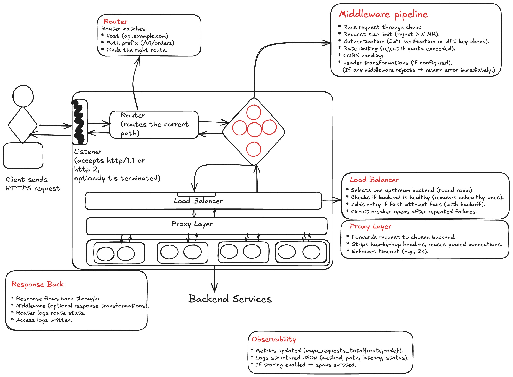

# 🌬️ Vayu – High Performance API Gateway for Kubernetes

Imagine you’re running a Kubernetes cluster with 10+ microservices.  
You’ve got `user-service`, `order-service`, `payment-service` – all talking to each other, all needing to be exposed to the outside world.  

Now, here comes the problem:  
- Do you expose every service individually?  
- Do you add TLS, authentication, logging, and monitoring inside each one?  
- Or do you want **one secure, observable, lightning-fast entry point** for everything?

That’s where **Vayu** steps in.  
Just like the wind it’s named after, Vayu flows **fast**, **light**, and **powerful**, carrying requests securely into your cluster.  

---

## ✨ What is Vayu?

Vayu is a **high-performance API Gateway for Kubernetes**, written in Go.  
It acts as the **front door** to your services, handling traffic from clients and routing it to the right microservice.  

With **v1.0.1**, Vayu is ready to be used in production as a **Kubernetes Ingress Gateway**.  

---

## 🚀 Features in v1.0.1

- 🔀 **Smart Routing**  
  Route traffic to your microservices based on paths and prefixes.  
  Example:  
  - `/users` → `user-service:8080`  
  - `/orders` → `order-service:8080`

- 🔒 **Secure by Default**  
  - TLS termination (HTTPS at the gateway).  
  - API Key validation.  
  - JWT validation (OAuth2 / OIDC support).  

- 📊 **Observability Built-in**  
  - Prometheus metrics at `/metrics`.  
  - Health endpoints: `/healthz`, `/readyz`.  
  - Structured JSON logs for easy parsing.  

- ⚡ **High Performance**  
  - Built with Go’s `net/http` and optimized async handling.  
  - Connection pooling & keep-alives.  
  - Designed for low latency (<1ms overhead).  

- 🐳 **Cloud Native Deployment**  
  - Lightweight Docker image.  
  - Helm chart for Kubernetes.  
  - Configurable via ConfigMap or YAML file.  

---

## 🏗️ Example Flow

A web client makes a request:  

```bash
GET https://api.company.com/orders
Authorization: Bearer <JWT>
```


Vayu does the heavy lifting:  
1. Terminates TLS (secure HTTPS).  
2. Validates the JWT token.  
3. Routes the request to the `order-service` pod.  
4. Logs the request + exports Prometheus metrics.  
5. Returns the response to the client.  

All services stay **clean** – they just focus on business logic.  
Vayu takes care of **security, routing, and observability**.  

---

## 📐 Architecture



## ⚙️ Quick Start (Kubernetes)
```bash
# Install with Helm
helm repo add vayu https://charts.vayu.io
helm install vayu vayu/vayu-gateway

# Apply routes
kubectl apply -f vayu-routes.yaml
```

Example vayu-routes.yaml:
```yaml
server:
  port: 8080
routes:
  - path: /users
    upstream: http://localhost:8081
  - path: /orders
    upstream: http://localhost:8082
```

## 🛣️ Roadmap

v1.1.0 → Rate limiting, CORS, header transformations.

v1.2.0 → Service discovery, retries, traffic splitting.

v2.0.0 → Plugin system, east-west traffic support, API monetization.

## 🌬️ Why the name Vayu?

In ancient Indian mythology, Vayu is the god of wind – fast, invisible, and powerful.
Just like the wind, Vayu is designed to flow traffic quickly and securely across your systems.

## 👨‍💻 Contributing

Vayu is open source. Contributions, issues, and feature requests are welcome.
Let’s build the next-gen gateway together.
